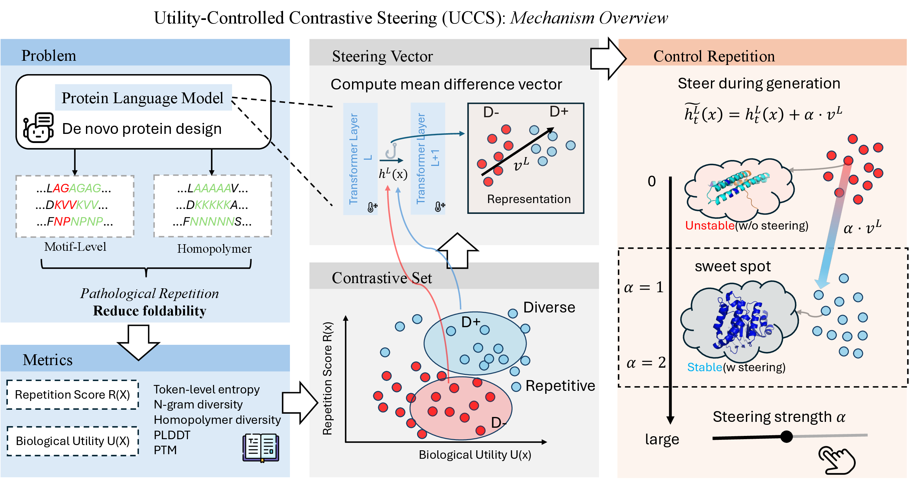

# Controlling-Repetition-in-Protein-Language-Models

｜ Official implementation of “Controlling Repetition in Protein Language Models” (ICLR 2026)

## Paper at a glance

- **Problem**: PLMs often fall into motif repetition or homopolymers, which destroys foldability.
- **Method (UCCS: Utility-Controlled Contrastive Steering)**: contrastive steering vectors learned on balanced pos/neg pools that disentangle repetition from structure.
- **Scope**: supports masked (ESM3), autoregressive (ProtGPT2/ProGen2), and diffusion (DPLM) backends; works with both unconditional and prefix-conditioned generation.
- **Key outcome**: reduces repetition while preserving pLDDT/pTM; baselines, ablations, and sweeps are scripted for direct reruns.

**Mechanism overview**  
  
[View as PDF](assets/figures/mechanism.pdf)

## Quick start (reproducible)

```bash
python -m venv .venv
source .venv/bin/activate  # or .venv\Scripts\activate on Windows
python -m pip install --upgrade pip
pip install -r requirements/runtime.txt
pip install -e .
PYTHONPATH=src pytest -q      # optional sanity check
```

## Reproduce the paper

- **Single-run replica (UCCS on PROGEN2-Base)**  
  `python scripts/py/run/main_experiment.py exp.id=paper_uccs_progen2 runtime.device=cuda dataset=posneg models=progen2_base methods=contrastive_layer methods.layer=0 generation.uncond.n=100 generation.prefix.n=100`
- **Metric evaluation**  
  `python scripts/py/run/evaluate_sequences.py outputs/paper_uccs_progen2/run_*/uncond.steer.fasta --structure-model esm3 --structure-device cuda`
- **Full sweeps (paper tables)**  
  - ESM3 (masked): `python scripts/py/run/sweeps/sweep_esm3.py --json > sweep_esm3.json`  
  - ESM2 (masked): `python scripts/py/run/sweeps/sweep_esm2.py --json > sweep_esm2.json`  
  - ProGen2-Base: `python scripts/py/run/sweeps/sweep_progen2_base.py --json > sweep_progen2_base.json`  
  - DPLM: `python scripts/py/run/sweeps/sweep_dplm.py --json > sweep_dplm.json`  
  - Decoding ablations (ESM3 + ProGen2): `python scripts/py/run/sweeps/sweep_ablation_decoding.py --json > sweep_ablation_decoding.json`

More detail and determinism tips: `docs/REPRODUCIBILITY.md`.

## Data

Curated positive pools (CATH/SCOP/UniProt) and LM-generated negative pools are prepackaged under `data/`. Metrics CSVs align with the Hydra dataset configs (`configs/dataset/posneg.yaml`). Regeneration instructions live in `data/README.md`.

## Hydra config system

Configurations are managed via Hydra; override modules by selecting configs under `configs/{dataset,models,methods}` when running CLI entry points.

### Adding a custom dataset

1. Implement a class that inherits `replm.datasets.base.DatasetProvider` and overrides `iter_pos`, `iter_neg`, and optionally `build`.
2. Create a new Hydra config under `configs/dataset/<name>.yaml` with `_target_` pointing to your class (and any kwargs).
3. Launch experiments with `dataset=<name>` to select the provider.

### Hugging Face causal language models

The `hf_causal_lm` backend wraps `AutoModelForCausalLM`, so any Hugging Face protein LM can be used by adding a config under `configs/models/`. We ship presets for:

- `models=protgpt2` → `nferruz/ProtGPT2` (residue lengths are converted to token counts assuming ~4 residues/token)
- `models=progen2_small` → `hugohrban/progen2-small` (handles the extra `<|endoftext|>` token by requesting `L+1` tokens)

These configs expose `backend_kwargs` so you can tweak tokenizer/model/generation kwargs and prompts without touching code.

## Citation

If you find this repository helpful, please cite our ICLR 2026 paper:  
**Controlling Repetition in Protein Language Models**, OpenReview ID: X0QxVexIJX.

BibTeX:

```bibtex
@misc{zhang2026controllingrepetitionproteinlanguage,
  title   = {Controlling Repetition in Protein Language Models},
  author  = {Zhang, Jiahao and Zhang, Zeqing and Wang, Di and Hu, Lijie},
  year    = {2026},
  eprint  = {2602.00782},
  archivePrefix = {arXiv},
  primaryClass  = {q-bio.BM},
  url     = {https://arxiv.org/abs/2602.00782}
}
```
